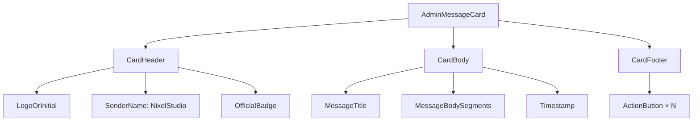

# Design Document — AdminMessageCard

## Overview

`AdminMessageCard` adalah komponen React UI mobile-first yang menampilkan satu pesan resmi dari admin dalam format card terstruktur. Komponen ini dirancang untuk digunakan di dalam `UserInboxBanner.tsx` sebagai pengganti JSX inline yang menampilkan pesan bertipe `"message"`, sehingga logic polling dan dismiss yang sudah ada dapat dipertahankan sepenuhnya.

Komponen tidak memiliki state internal apapun yang berhubungan dengan data (stateless dari sisi bisnis). Seluruh data pesan dan handler aksi diterima lewat props. Ini menjaganya mudah diuji dan mudah di-compose.

**Stack yang digunakan:** Next.js 15 (App Router), React 19, TypeScript 5.8, inline styles (konsisten dengan pola `UserInboxBanner`). Tidak ada library UI eksternal baru. Testing menggunakan Jest + React Testing Library + fast-check (property-based testing).

---

## Architecture

### Posisi dalam sistem

```
app/layout.tsx
  └── UserInboxBanner          ← komponen existing (polling, dismiss, drawer)
        └── AdminMessageCard   ← komponen baru (pure presentational)
```

`UserInboxBanner` mempertahankan seluruh state dan side-effect (polling, sessionStorage, markRead). Ia menginstansiasi `AdminMessageCard` di dalam center-popup modal dan meneruskan `activeMsg`, `handleDismiss`, dan action buttons yang relevan.

### Alur data

```
UserInboxBanner (state owner)
  │  activeMsg: AdminMessage
  │  handleDismiss: (msg) => void
  │
  └─► AdminMessageCard
        │  message: AdminMessage      (dari activeMsg)
        │  actions: ActionButton[]    (tombol navigasi / dismiss)
        │  onDismiss: (msg) => void   (dari handleDismiss)
        │  senderLogoUrl?: string     (opsional)
        │
        ├─► Header
        │     logo/inisial · "NixelStudio" · OfficialBadge
        ├─► Body
        │     title · body (multiline) · timestamp
        └─► Footer
              ActionButtons (termasuk auto-injected "Tutup" dari onDismiss)
```

### Diagram komponen internal



---

## Components and Interfaces

### `AdminMessageCard` (komponen utama)

**File:** `components/AdminMessageCard.tsx`

```typescript
import type { AdminMessage } from "./UserInboxBanner";

export interface ActionButton {
  label: string;
  onClick: (() => void) | undefined;
  variant?: "primary" | "secondary";
}

interface AdminMessageCardProps {
  message: AdminMessage | null;
  actions?: ActionButton[];
  onDismiss?: (message: AdminMessage) => void;
  senderLogoUrl?: string;
}

export default function AdminMessageCard(props: AdminMessageCardProps): JSX.Element | null
```

**Kontrak perilaku:**
- Jika `message` adalah `null`, mengembalikan `null`.
- Footer hanya dirender jika ada minimal satu tombol (dari `actions` atau auto-injected dari `onDismiss`).
- Tombol "Tutup" dari `onDismiss` hanya ditambahkan jika tidak ada item di `actions` dengan `label === "Tutup"`.
- Seluruh sub-komponen (Header, Body, Footer) adalah function lokal atau inline JSX di dalam file yang sama. Tidak perlu dipisah ke file terpisah karena scope penggunaan terbatas.

### Sub-komponen internal

| Sub-komponen | Tanggung jawab |
|---|---|
| `renderHeader` | Logo/inisial, nama pengirim, OfficialBadge |
| `renderBody` | Judul, isi pesan (multiline), timestamp |
| `renderFooter` | Daftar tombol aksi, layout responsif |

### Modifikasi pada `UserInboxBanner.tsx`

Bagian **Central Message Modal Popup** (baris ~963–1145) yang merender `activeMsg` bertipe `"message"` akan direfaktor:

**Sebelum:** JSX inline dua-kolom landscape dengan sidebar + konten.  
**Sesudah:** Wrap `AdminMessageCard` di dalam overlay backdrop yang sudah ada. Sidebar kolom kiri dihilangkan karena logika branding dipindah ke header card. Overlay backdrop (blur, ambient glows) tetap dipertahankan.

```tsx
// Di dalam UserInboxBanner — ganti blok JSX inline dengan:
{showCenterPopup && activeMsg && (
  <div className="inbox-modal" style={/* overlay backdrop */}>
    <AdminMessageCard
      message={activeMsg}
      onDismiss={handleDismiss}
      actions={
        unreadMessages.length > 1 && safeIdx < unreadMessages.length - 1
          ? [{ label: "Berikutnya →", onClick: () => { handleDismiss(activeMsg); setCurrentIdx(safeIdx + 1); } }]
          : []
      }
    />
  </div>
)}
```

---

## Data Models

### `AdminMessage` (existing, diekspor dari `UserInboxBanner.tsx`)

```typescript
export interface AdminMessage {
  id: string;
  type: "message" | "refresh" | "block";
  title: string;
  body: string;
  reason?: string;
  targetUserId?: string;
  targetEmail?: string;
  targetUsername?: string;
  sentAt: string;       // ISO 8601 string
  sentByEmail?: string;
}
```

`AdminMessageCard` mengimpor tipe ini secara langsung — tidak mendefinisikan ulang.

### `ActionButton` (baru, diekspor dari `AdminMessageCard.tsx`)

```typescript
export interface ActionButton {
  label: string;
  onClick: (() => void) | undefined;
  variant?: "primary" | "secondary";
}
```

### Format timestamp

Timestamp diformat menggunakan:

```typescript
new Date(message.sentAt).toLocaleString("id-ID", {
  day: "2-digit",
  month: "short",
  hour: "2-digit",
  minute: "2-digit",
})
```

Jika `new Date(sentAt)` menghasilkan `NaN` (invalid date), ditampilkan teks `"(Waktu tidak tersedia)"`.

### Format multiline body

```typescript
message.body
  .split("\n")
  .filter(segment => segment.trim().length > 0)
  .map((segment, i) => <span key={i} style={{ display: "block" }}>{segment}</span>)
```

---

## Correctness Properties

*A property is a characteristic or behavior that should hold true across all valid executions of a system — essentially, a formal statement about what the system should do. Properties serve as the bridge between human-readable specifications and machine-verifiable correctness guarantees.*

Fitur ini berisi logika transformasi data (rendering judul/body/timestamp dengan fallback, multiline splitting, button injection, variant mapping) yang merupakan pure function dari props ke output. Property-based testing sangat sesuai karena:
- Input space sangat luas (arbitrary strings untuk title/body/sentAt)
- Logika fallback dan edge-case sulit dicakup dengan contoh manual
- 100+ iterasi dapat menemukan pola newline, karakter unicode, dan string edge-case yang tidak terduga

**Library PBT:** `fast-check` (TypeScript-native, kompatibel dengan Jest/Vitest)

---

### Property 1: Struktur tiga-bagian untuk semua pesan valid

*For any* valid `AdminMessage` object dan non-empty `actions` array, rendering `AdminMessageCard` harus menghasilkan elemen DOM yang mengandung tiga bagian terpisah — header, body, dan footer — dalam urutan vertikal yang benar, dengan header selalu muncul sebelum body dan body sebelum footer.

**Validates: Requirements 1.1**

---

### Property 2: Fallback konten Body

*For any* `AdminMessage` di mana `title` adalah null, string kosong, atau undefined, elemen judul yang dirender harus menampilkan teks `"(Tanpa Judul)"`. Sebaliknya, *for any* non-empty title, elemen judul harus menampilkan nilai title tersebut persis. Properti yang sama berlaku untuk `body` dengan fallback `"(Tidak ada isi pesan)"`.

**Validates: Requirements 3.1, 3.2**

---

### Property 3: Validasi dan formatting timestamp

*For any* string ISO 8601 yang valid sebagai nilai `sentAt`, output yang dirender harus berisi representasi tanggal yang diformat (bukan `"(Waktu tidak tersedia)"`). *For any* string yang tidak dapat di-parse menjadi Date yang valid (misalnya string acak non-ISO), output yang dirender harus berisi teks `"(Waktu tidak tersedia)"`.

**Validates: Requirements 3.3**

---

### Property 4: Multiline body splitting

*For any* body string yang mengandung satu atau lebih karakter `\n`, jumlah elemen blok yang dirender harus sama persis dengan jumlah segmen non-empty setelah memisahkan string dengan `\n` dan memfilter segmen yang panjangnya nol setelah trim.

**Validates: Requirements 3.4**

---

### Property 5: Jumlah tombol sama dengan panjang actions

*For any* `actions` array dengan panjang N (N ≥ 1) dan tanpa `onDismiss` yang menyebabkan injeksi tombol "Tutup" baru, Footer harus merender tepat N elemen `<button>`.

**Validates: Requirements 4.1**

---

### Property 6: Gaya variant tombol

*For any* `ActionButton` dengan `variant = "primary"`, tombol yang dirender harus memiliki inline style dengan `background` yang berupa nilai warna solid (bukan `"transparent"`). *For any* `ActionButton` dengan `variant = "secondary"` atau tanpa variant, tombol yang dirender harus memiliki inline style dengan `background: "transparent"` (atau setara) dan border yang terlihat.

**Validates: Requirements 4.6, 4.7, 4.8**

---

### Property 7: Logo fallback untuk senderLogoUrl tidak valid

*For any* falsy value atau string kosong sebagai `senderLogoUrl`, elemen teks inisial `"NS"` harus selalu dirender di header dan tidak ada elemen `` yang ditampilkan.

**Validates: Requirements 2.6**

---

### Property 8: Injeksi tombol "Tutup" dari onDismiss (idempotency)

*For any* `AdminMessage` dan *for any* `actions` array:
- Jika `actions` tidak mengandung item berlabel `"Tutup"` DAN `onDismiss` diberikan, maka footer harus mengandung tepat satu tombol berlabel `"Tutup"`.
- Jika `actions` sudah mengandung item berlabel `"Tutup"` DAN `onDismiss` diberikan, maka footer tetap harus mengandung tepat satu tombol berlabel `"Tutup"` (tidak duplikat).

**Validates: Requirements 6.2, 6.3**

---

### Property 9: ARIA region pada semua instance

*For any* valid `AdminMessage`, elemen kontainer root `AdminMessageCard` yang dirender harus memiliki atribut `role="region"` dan `aria-label="Pesan resmi dari NixelStudio"`.

**Validates: Requirements 7.1**

---

### Property 10: Isolasi rendering (tanpa provider)

*For any* valid `AdminMessage` dan `actions` array, rendering `AdminMessageCard` sebagai child dari `<div>` biasa tanpa context atau provider apapun harus berhasil tanpa error dan menghasilkan elemen non-null ke DOM.

**Validates: Requirements 6.5**

---

## Error Handling

| Skenario | Penanganan |
|---|---|
| `message` adalah `null` | Kembalikan `null` dari komponen, tidak ada elemen DOM |
| `message.title` kosong/null | Tampilkan placeholder `"(Tanpa Judul)"` |
| `message.body` kosong/null | Tampilkan placeholder `"(Tidak ada isi pesan)"` |
| `message.sentAt` tidak valid | Tampilkan `"(Waktu tidak tersedia)"`, gunakan `try/catch` atau `isNaN` check |
| `senderLogoUrl` gagal dimuat | Handler `onError` pada `` switch ke tampilan inisial "NS" via React state boolean |
| `actions[i].onClick` adalah `undefined` | Render tombol dengan atribut `disabled={true}`, tidak pasang event handler |
| `actions` adalah `[]` atau tidak diberikan | Tidak render elemen Footer sama sekali |
| Segmen body kosong setelah split `\n` | Filter dengan `segment.trim().length > 0` sebelum render |

### Penanganan error gambar (senderLogoUrl)

```typescript
const [imgError, setImgError] = useState(false);

// Di JSX:
{senderLogoUrl && !imgError ? (
   setImgError(true)}
    style={/* ... */}
  />
) : (
  <span aria-hidden="true">NS</span>
)}
```

State `imgError` adalah satu-satunya internal state yang diperbolehkan di komponen ini.

---

## Testing Strategy

### Pendekatan dual testing

Dua jenis tes digunakan secara komplementer:

- **Unit tests (example-based):** Kasus konkret, edge case, dan verifikasi integrasi.
- **Property tests (property-based):** Properti universal yang harus berlaku untuk semua input yang valid.

### Setup testing

Karena proyek saat ini tidak memiliki test runner, perlu ditambahkan:

```jsonc
// devDependencies yang perlu ditambahkan
"jest": "^29",
"@types/jest": "^29",
"jest-environment-jsdom": "^29",
"@testing-library/react": "^16",
"@testing-library/jest-dom": "^6",
"fast-check": "^3",
"ts-jest": "^29"
```

**Konfigurasi minimum 100 iterasi per property test:**

```typescript
fc.assert(fc.property(/* ... */), { numRuns: 100 });
```

### Unit tests (example-based)

Fokus pada kasus-kasus yang tidak dicakup oleh property tests:

| Test | Kasus |
|---|---|
| Null message | Render dengan `message={null}` → tidak ada elemen DOM |
| Empty actions | `actions={[]}` → tidak ada elemen Footer |
| onClick=undefined | Tombol dirender dengan `disabled` |
| Teks konstan | "NixelStudio" dan "Pesan Resmi" selalu ada |
| ARIA badge | OfficialBadge punya `aria-label="Pesan Resmi"` |
| senderLogoUrl valid | `` muncul dengan src dan alt yang benar |
| Variant primary | Tombol punya background solid |
| Variant secondary | Tombol punya background transparent dan border |

### Property tests (fast-check)

Setiap property test diberi tag komentar referensi ke design property:

```typescript
// Feature: admin-message-card, Property 1: Struktur tiga-bagian untuk semua pesan valid
test("struktur tiga-bagian untuk semua pesan valid", () => {
  fc.assert(
    fc.property(arbitraryAdminMessage(), arbitraryNonEmptyActions(), (msg, actions) => {
      // ... render and assert
    }),
    { numRuns: 100 }
  );
});
```

**Arbitrary generators yang perlu dibuat:**

```typescript
// Generator pesan valid dengan berbagai kombinasi field
const arbitraryAdminMessage = () => fc.record({
  id: fc.string({ minLength: 1 }),
  type: fc.constantFrom("message" as const, "refresh" as const, "block" as const),
  title: fc.oneof(fc.string(), fc.constant(""), fc.constant(null as unknown as string)),
  body: fc.string(),
  sentAt: fc.oneof(
    fc.date().map(d => d.toISOString()),
    fc.string()  // termasuk invalid dates
  ),
});

// Generator array action non-kosong
const arbitraryNonEmptyActions = () =>
  fc.array(
    fc.record({
      label: fc.string({ minLength: 1 }),
      onClick: fc.oneof(fc.constant(undefined), fc.constant(() => {})),
      variant: fc.option(fc.constantFrom("primary" as const, "secondary" as const)),
    }),
    { minLength: 1 }
  );
```

### Cakupan per Requirement

| Requirement | Jenis Test | Property # |
|---|---|---|
| 1.1 Struktur tiga bagian | Property | Property 1 |
| 1.4 Null message | Example | — |
| 1.5 Empty actions | Example | — |
| 2.2 Teks "NixelStudio" | Example | — |
| 2.3 Teks "Pesan Resmi" | Example | — |
| 2.5 senderLogoUrl img | Example | — |
| 2.6 Fallback "NS" | Property | Property 7 |
| 3.1 Title fallback | Property | Property 2 |
| 3.2 Body fallback | Property | Property 2 |
| 3.3 Timestamp format | Property | Property 3 |
| 3.4 Multiline split | Property | Property 4 |
| 4.1 Button count | Property | Property 5 |
| 4.2 onClick dipanggil | Property | (cakupan oleh Property 5+8) |
| 4.3 disabled button | Example | — |
| 4.6–4.8 Variant styling | Property | Property 6 |
| 6.2–6.3 Dismiss injection | Property | Property 8 |
| 6.5 Isolasi rendering | Property | Property 10 |
| 7.1 ARIA region | Property | Property 9 |
| 7.2 ARIA badge | Example | — |
| 5.x Responsive CSS | Smoke | — |
| 7.3–7.4 Kontras/fokus | Smoke | — |
